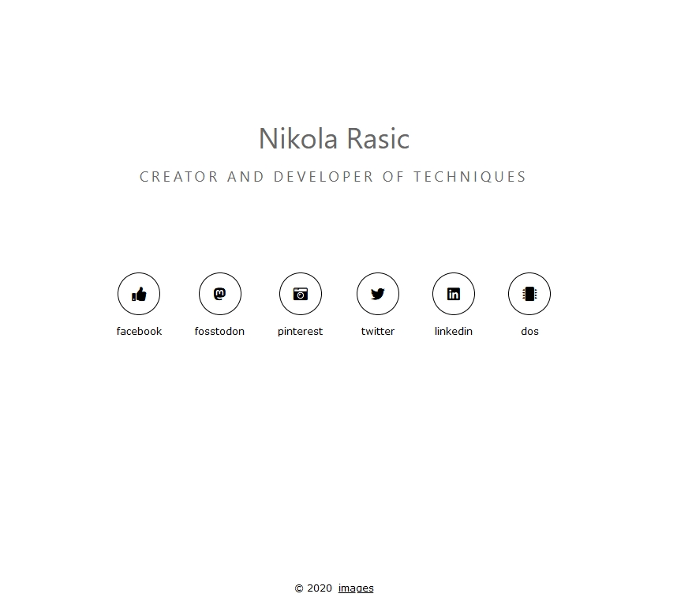

# W3CSS Theme

This is a modified version of the [photo theme](https://www.w3schools.com/w3css/tryw3css_templates_photo2.htm) from w3css.
If you'd like to use this theme, take a look at the w3css classes. You can create nice looking elements this way. A list of examples can be found over on [the w3css documentation](https://www.w3schools.com/w3css/w3css_demo.asp).



Demo: <https://pangx.se>

For the social icons use:
```<div class="w3-bar w3-large w3-social-row">
  <a href="https://www.facebook.com/cuper.mannen">
    <span class="w3-button w3-border-black w3-border w3-circle w3-ripple w3-hover-black fas fa-thumbs-up"></span>
    <span class="w3-small">facebook</span>
  </a>
  <a href="https://fosstodon.org/web/accounts/186650">
    <span class="w3-button w3-border-black w3-border w3-circle w3-ripple w3-hover-black fab fa-mastodon"></span>
    <span class="w3-small">fosstodon</span>
  </a>
  <a href="https://www.pinterest.se/electofgod3317">
    <span class="w3-button w3-border-black w3-border w3-circle w3-ripple w3-hover-black fas fa-camera-retro"></span>
    <span class="w3-small">pinterest</span>
  </a>
  <a href="https://twitter.com/digitalstigmata">
    <span class="w3-button w3-border-black w3-border w3-circle w3-ripple w3-hover-black fab fa-twitter"></span>
    <span class="w3-small">twitter</span>
  </a>
  <a href="https://www.linkedin.com/in/nikola-rasic-685991178/">
    <span class="w3-button w3-border-black w3-border w3-circle w3-ripple w3-hover-black fab fa-linkedin"></span>
    <span class="w3-small">linkedin</span>
  </a>
</div>
```

If you'd like the same footer, use the following HTML:
```HTML
<p class="w3-small">
  Hire me via <a href="https://pangx.se" class="w3-hover-text-gray">Pangx</a> &nbsp; &middot; &nbsp; 
  <a href="/about" class="w3-hover-text-gray">About me</a>
</p>
```
